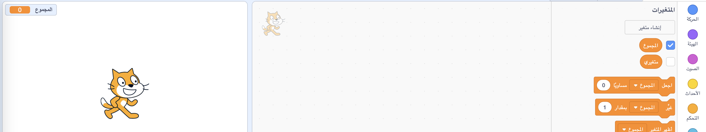

انقر فوق **المتغيرات** في علامة تبويب النصوص البرمجية، ثم انقر فوق **إنشاء متغير**.


قم بكتابة اسم للمتغير. يمكنك اختيار ما إذا كنت تريد هذا المتغير أن يكون متاح لجميع الكائنات، أو فقط لهذا المتغير. اضغط على **موافق**.


سيظهر المتغير على المنصة:



إذا كنت تريد إخفاء المتغير على المنصة، فقم بإلغاء تحديد المربع المجاور للمتغير في كتل القائمة `المتغيرات`{:class="block3variables"}.

## تحديد قيمة البداية

إذا كان يجب أن يكون للمتغير الخاص بك نفس قيمة البداية في كل مرة يتم فيها تشغيل مشروعك ، فقم بإضافة نص برمجي لتعيينه:

```blocks3
when flag clicked
set [المجموع v] to [0]
```  
