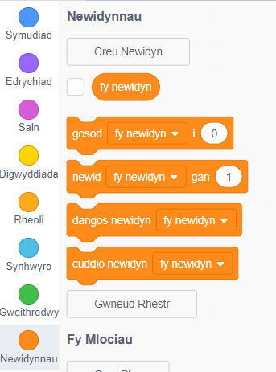
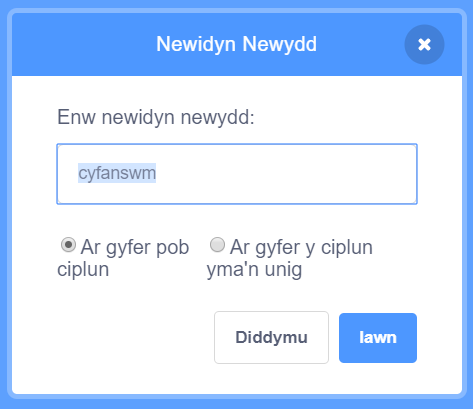
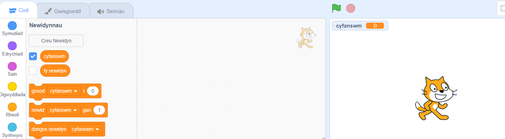

Clicia ar **Newidynnau** yn y tab Côd, yna clicia ar **Creu Newidyn**.



Teipia enw dy newidyn. Mae modd i ti ddewis os wyt ti eisiau i dy newidyn fod ar gael i'r corluniau i gyd, neu dim ond y corlun yma. Clicia **Iawn**.



Bydd y newidyn yn ymddangos ar y Llwyfan:



Os wyt ti am guddio'r newidyn ar y Llwyfan, dad-dicia'r blwch wrth ymyl y newidyn yn y ddewislen blociau `Newidynnau`{:class="block3variables"}.

## Gosod gwerth cychwynnol

Os dylai dy newidyn gael yr un gwerth cychwynnol bob tro mae dy brosiect yn cael ei redeg, yna ychwanega sgript i'w osod:

```blocks3
when flag clicked
set [total v] to [0]
```  
