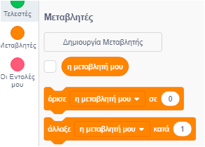
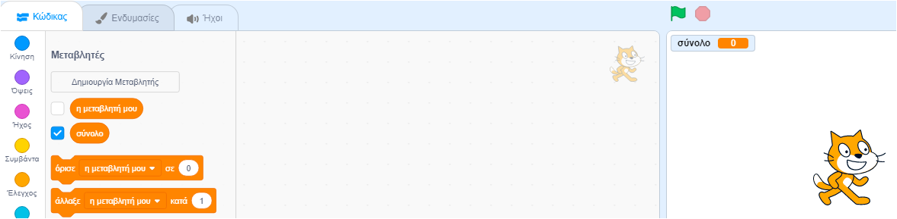

Κάνε κλικ στις **Μεταβλητές** στην καρτέλα Κώδικας και, στη συνέχεια, κάνε κλικ στη **Δημιουργία Μεταβλητής**.



Πληκτρολόγησε το όνομα της μεταβλητής σου. Μπορείς να επιλέξεις αν θέλεις η μεταβλητή σου να είναι διαθέσιμη σε όλα τα αντικείμενα ή μόνο σε αυτό το αντικείμενο. Πάτησε **ΟΚ**.


Η μεταβλητή θα εμφανιστεί στη Σκηνή:



Εάν θέλεις να κρύψεις τη μεταβλητή από τη Σκηνή, ακύρωσε την επιλογή του πλαισίου δίπλα από τη μεταβλητή σου στο μενού `Μεταβλητές`{:class="block3variables"}.

## Ορισμός αρχικής τιμής

Εάν η μεταβλητή σου πρέπει να έχει την ίδια αρχική τιμή κάθε φορά που εκτελείται το έργο σου, τότε πρόσθεσε ένα script για να το καθορίσεις:

```blocks3
when flag clicked
set [σύνολο v] to [0]
```  
