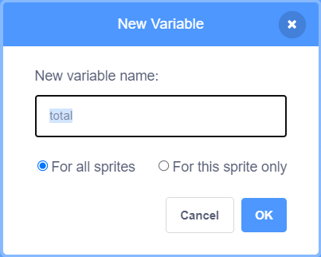
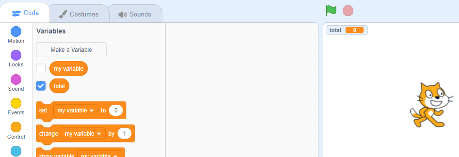

Click on **Variables** in the Code tab, then click on **Make a Variable**.


Type in the name of your variable. You can choose whether you would like your variable to be available to all sprites, or to only this sprite. Press **OK**.



The variable will show on the Stage:



If you want to hide the variable on the Stage, uncheck the box next to the variable in the `Variables`{:class="block3variables"} blocks menu.

## Setting a start value

If your variable should have the same starting value every time your project is run, then add a script to set it:

```blocks3
when flag clicked
set [total v] to [0]
```  
