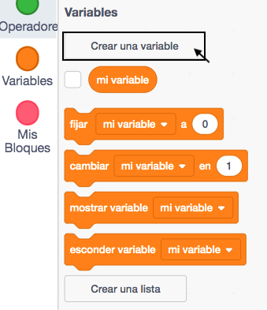
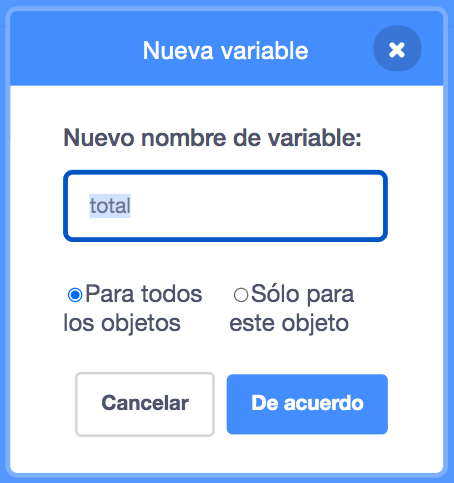
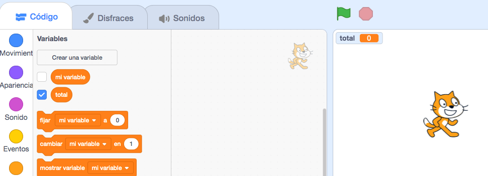

Haz clic en **Variables** en la pestaña Código, luego haz clic en **Crear una variable**.



Escribe el nombre de tu variable. Puedes elegir si quieres que tu variable esté disponible para todos los objetos o solo para este. Presiona **De acuerdo**.



La variable se mostrará en el Escenario:



Si quieres esconderla en el Escenario, desmarca la casilla junto a la variable en el Menú de bloques `Variables`{:class="block3variables"}.

## Establece un valor inicial

Si tu variable debe tener el mismo valor inicial cada vez que se ejecuta tu proyecto, agrega un script para establecerlo:

```blocks3
when flag clicked
set [total v] to [0]
```  
