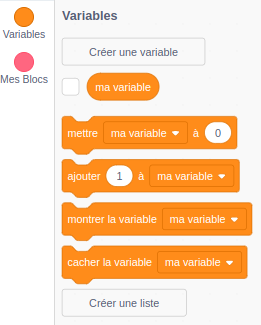
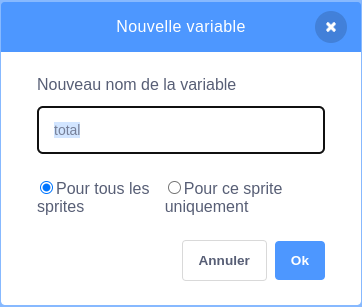
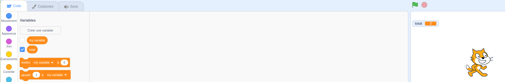

Clique sur **Variables** dans l'onglet Code, puis clique sur **Créer une variable**.



Tape le nom de ta variable. Tu peux choisir si ta variable est disponible pour tous les sprites ou seulement pour celui-ci. Appuie sur **OK**.



La variable s'affichera sur la scène :



Si tu souhaites masquer la variable sur la scène, décoche la case située à côté de la variable dans le menu des blocs `Variables`{:class="block3variables"}.

## Définir une valeur de départ

Si ta variable doit avoir la même valeur de départ à chaque exécution de ton projet, ajoute un script pour la définir :

```blocks3
when flag clicked
set [total v] to [0]
```  
