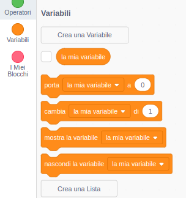
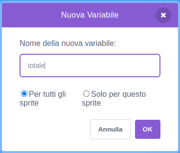
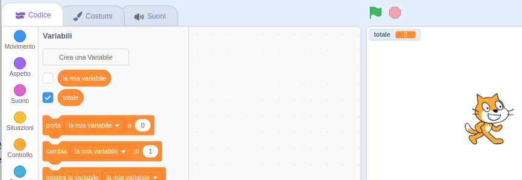

Clicca su **Variabili** nella scheda Codice, poi clicca su **Crea una Variabile**.



Inserisci il nome della tua variabile. Puoi scegliere se rendere la tua variabile accessibile a tutti gli sprite o solo a questo sprite. Premi **OK**.



La variabile apparirà nello Stage:



Se vuoi nascondere la variabile nello Stage, deseleziona la casella accanto alla variabile nel menu dei blocchi `Variabili`{:class="block3variables"}.

## Impostazione del valore di partenza

Se la tua variabile deve avere lo stesso valore di partenza ogni volta che il progetto viene eseguito, aggiungi uno script per impostarlo:

```blocks3
when flag clicked
set [totale v] to [0]
```  
