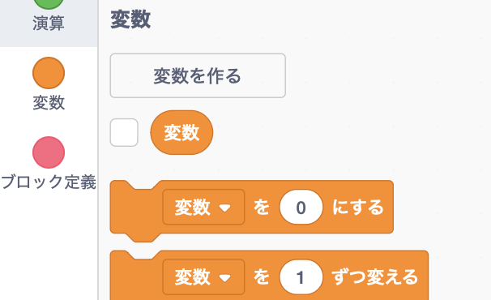
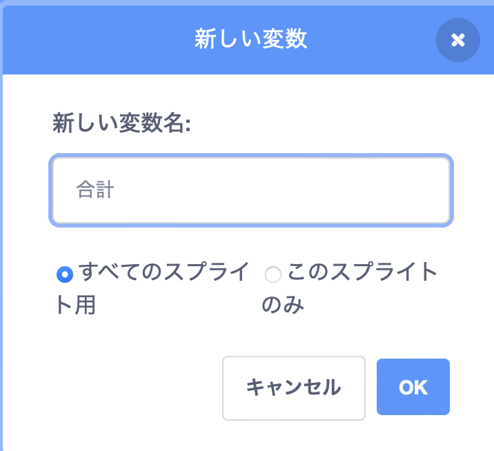
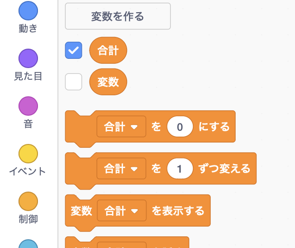

コードタブから**変数**をクリックし、**変数を作る**をクリックします。



変数の名前を入力します。 作った変数をすべてのスプライトで使うか、このスプライトのみで使うかを選べます。 **OK**をクリックします。



作成した変数がステージ上に表示されます。



ステージで変数を非表示にする場合は、 `変数`{:class="block3variables"}ブロックメニューで変数の横にあるボックスのチェックをはずします。

## 初期値の設定

プロジェクトを実行した時にいつも変数が同じ初期値を持つようにしたい場合は、スクリプトを追加して値を設定します。

```blocks3
when flag clicked
set [total v] to [0]
```  
