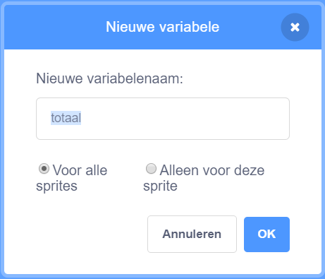

Klik op **Variabelen** in het Code tabblad en klik vervolgens op **Maak een variabele**.


Typ de naam van je variabele in. Je kunt kiezen of je wilt dat je variabele beschikbaar is voor alle sprites of alleen voor deze sprite. Klik op **OK**.



De variabele wordt op het Speelveld weergegeven:


Als je de variabele in het Speelveld wilt verbergen, schakel je het selectievakje naast de variabele in het `Variabelen`{:class="block3variables"} blok uit.

## Een startwaarde instellen

Als jouw variabele elke keer dat je project wordt uitgevoerd dezelfde startwaarde moet hebben, voeg dan een script toe om het in te stellen:

```blocks3
when flag clicked
set [total v] to [0]
```  
