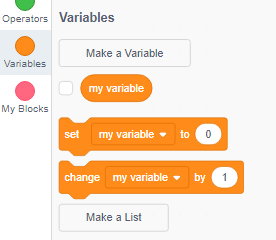
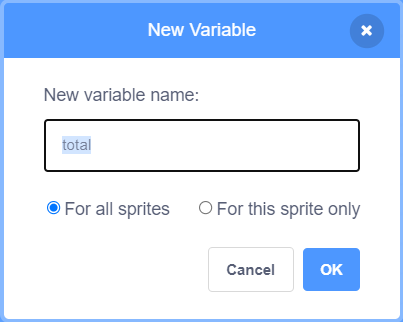
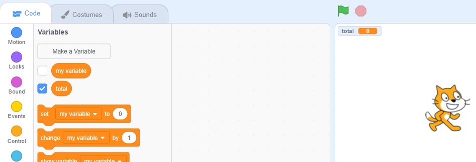

Kliknij na **Zmienne** w zakładce Kod, następnie kliknij na **Stwórz zmienną**.



Wpisz nazwę swojej zmiennej. Możesz zdecydować czy zmienna będzie dostępna dla wszystkich duszków, czy tylko dla tego duszka. Kliknij **OK**.



Zmienna pojawi się na ekranie:



Jeśli chcesz ukryć zmienną, odznacz pole obok zmiennej w menu bloków `Zmienne`{:class="block3variables"}.

## Ustawianie wartości początkowej

Jeśli zmienna powinna mieć tę samą wartość początkową przy każdym uruchomieniu projektu, dodaj skrypt, aby ją ustawić:

```blocks3
when flag clicked
set [total v] to [0]
```  
