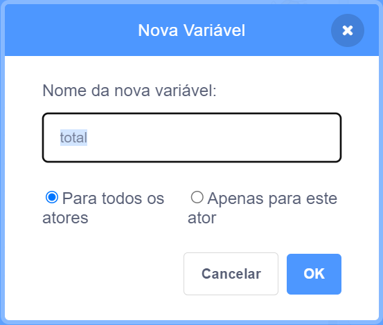

Clique em **Variáveis** no menu de blocos, então clique no botão **Criar uma Variável**.


Digite o nome da sua variável. Você pode escolher se quer que sua variável esteja disponível para todos os atores ou apenas para este ator. Clique em **OK**.



A variável aparecerá no Palco:


Se quiser ocultar a variável no Palco, desmarque a caixa ao lado da variável no menu de blocos `Variáveis`{:class="block3variables"}.

## Definindo um valor inicial

Se sua variável deve ter o mesmo valor inicial toda vez que seu projeto é executado, adicione um script para defini-la:

```blocks3
when flag clicked
set [total v] to [0]
```  
