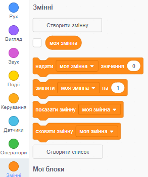
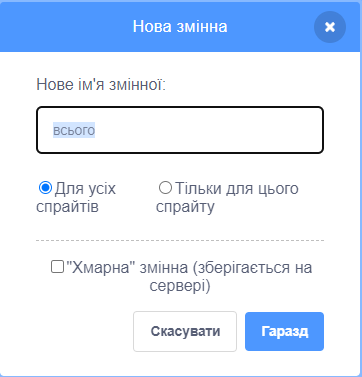
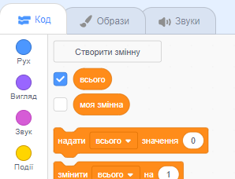

Натисни на розділ **Змінні** у вкладці Код, потім натисни **Створити змінну**.



Введи ім'я своєї змінної. В тебе є вибір: твоя змінна може бути доступною для всіх спрайтів, або тільки для цього конкретного спрайта. Натисни **Гаразд**.



Змінна з'явиться на Сцені:



Якщо ти хочеш сховати змінну на Сцені, прибери галочку навпроти змінної в меню блоків `Змінні`{:class="block3variables"}.

## Встановлення початкового значення

Якщо твоя змінна повинна мати однакове початкове значення при кожному запуску проєкту, додай скрипт для її встановлення:

```blocks3
when flag clicked
set [total v] to [0]
```  
